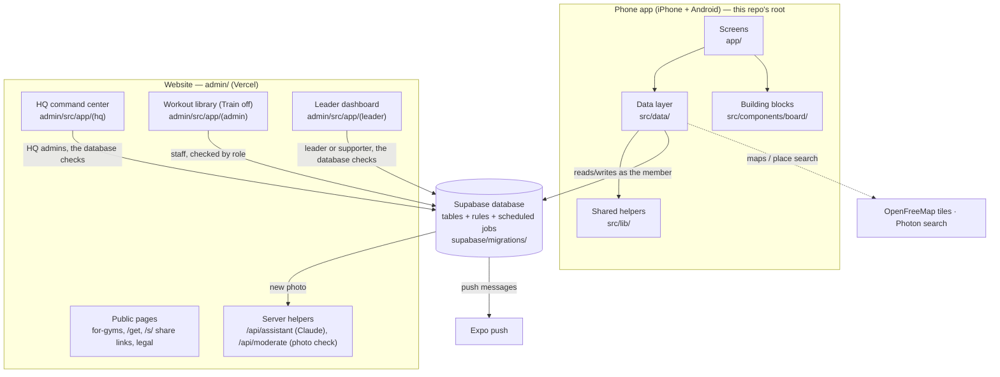

# Beast Tribe — How the app is organised

Last updated: 10 October 2026. Keep this file current after every task (see CLAUDE.md, rule 9).

## In one picture

**The rule of thumb:** screens show things, the data layer fetches and saves them, and the
**database decides what is allowed**. The database rules (row-level security, triggers and functions)
are the real gatekeeper, so even a tampered app can't see a private community or overbook a court.

## Folders

| Folder | What lives there |
|---|---|
| `app/` | Every phone screen, one file per screen (Expo Router: the file path is the screen's address). `(tabs)` = the bottom tabs, `(auth)` = sign-in, `(onboarding)` = the 3 sign-up steps. |
| `src/data/` | One file per topic that talks to the database: `sessions.ts`, `communities.ts`, `facilities.ts`, `routes.ts`… Screens call these, not the database. `query.ts` is the small cache all of them share. |
| `src/components/board/` | The visual building blocks ("Box Board" design): buttons, sheets, session cards, the route map, the price split. |
| `src/lib/` | Plain helpers with no screens: sports list, cities, location, times, notifications, constants and feature switches. |
| `src/i18n/` | All words, in English (`en.ts`) and Arabic (`ar.ts`). No text is written directly in screens. |
| `src/theme/` | Colours, type and spacing. |
| `src/providers/` | Sign-in state (`AuthProvider`). |
| `admin/` | The website (Next.js): HQ command center, leader dashboard, classic staff pages, public pages, two server helpers. |
| `supabase/migrations/` | Every database change, numbered in order. The database is only changed through these. |
| `scripts/` | Release (`release/ship-update.sh`), applying migrations (`run-migration.js`), content builders (workout library), brand assets, a load test. |
| `store/` | App Store and Google Play listing text and images. |
| `design/` | Design mock-ups and explainer pages (not part of the app). |
| `docs/` | The audit, the session history. |
| `admin/src/app/(leader)` | The leader dashboard for community leaders and supporters (see "Who uses what"). |
| `tests/` | Automated tests: app logic (`*.test.mjs`) and database rules (`tests/db/`, each run in a transaction that is rolled back). Run with `scripts/test.sh` and `scripts/test.sh db`. |

## How a typical action flows: "join a session"

1. **Screen** `app/session/[id]/index.tsx`: the member taps *I'm in*.
2. **Data layer** `src/data/sessions.ts` → `join()`: inserts a row into `event_rsvps`.
3. **Database** checks in `bt_rsvp_before`: is the session full (→ waiting list), women/men only, members only, the court's one-a-day rule. Then `bt_rsvp_after` updates the count, re-splits the court price and notifies the host.
4. **Push**: the host's phone gets "X joined your session" via Expo push.
5. **Screen** refreshes from the data layer's cache.

## Who uses what (the new dashboard, October 2026)

| Who | Where | How the role is stored |
|---|---|---|
| **Super admin** (the owner) and **admins** | HQ: `/hq`: Command center, Leaders & communities (+ Businesses), People, Sessions, Places & courts, Leads, Safety, Captains, Admins (super admin), Account. Old addresses (`/users`, `/events`, `/locations`, `/leads`, `/moderation`, `/partners`…) forward there (`admin/next.config.js`). | `admin_roles` (`super_admin`, `admin`, `moderator`). Only the super admin changes it: `set_admin_role()` |
| **Community leader** (coach, gym, trainer, company HR, activation lead) | Leader dashboard: `/leader` | `community_members.role = 'admin'` (shown as "Leader"). HQ adds leaders: `invite_to_team()` |
| **Community supporter** | Leader dashboard, fewer buttons, never sees money | `community_members.role = 'supporter'`. Leaders add them: `invite_to_team()` |
| **Member** | The app only | `community_members.role = 'member'` |

- **Invites** wait in `community_invites` until the person verifies their email (trigger `bt_on_auth_user_invites`).
- **Features** a community switched on live in `community_features` (courts, guests, coaching, nutrition, teams); each one with a page adds it to the leader menu (`admin/src/lib/leader/features.ts`).
- **Business record:** courts, coaching times and the plan hang off a `partners` row linked to the community, made when first needed (`admin/src/lib/leader/business.ts`).
- **Sign-in:** email + password, or "Email me a sign-in link" (`/login/link`) for people who joined the app with Apple or Google.

### The HQ command center (`admin/src/app/(hq)/hq/`)
- **Activity:** active today and this week, sessions and players today, the next 7 days, a map of members by city (MapLibre with the app's brand style, `components/board/CityMap.tsx`), today's sessions by hour, needs attention, every community's health, sports, phones and language, new members per week. Filter by city and day.
- **Growth:** leads funnel (`partner_leads` steps), lead sources, revenue by plan (`business_overview()`), sign-ups and first sessions, and "not connected yet" cards for social, website visits and installs until those accounts are connected.
- **Other HQ pages:** `admin/src/app/(hq)/hq/` `people` (super admin can delete an account: `delete_member()`, migration 099), `sessions`, `places`, `leads` (pipeline board), `safety` (reports, photos, posts, comments; moderators see only this and Account), `captains`, `businesses` (business records: coaches' free times, venues, restaurants' offers, plans), `communities/[id]` (details, join code, verify, starter groups, members, businesses, delete), `account` (two-step sign-in, shared with `/security`).
- **Data:** database functions `hq_live`, `hq_days`, `hq_day_sessions`, `hq_cities`, `hq_communities`, `hq_attention`, `hq_mix` (096) and `hq_growth` (097), all refusing anyone who isn't an HQ admin (`bt_require_hq`). Loaders in `admin/src/lib/hq/data.ts`.
- **Leaders & communities** (`/hq/communities`): add a leader by email (with a new or existing community), switch features, remove people. **Admins** (`/hq/admins`, super admin only).

### The leader dashboard (`admin/src/app/(leader)/leader/`)
- **Pages:** Home (numbers, players by day, insights, coming up), Sessions (post with a live app preview, players, check-in, who paid, cancel), Courts, Coaching, Nutrition, Teams (only when switched on), People, Features, Profile.
- **Data:** `admin/src/lib/leader/` (context, overview, sessions, people, courts, coaching, business). Home numbers come from the database function `community_overview()`, which refuses outsiders and returns money only to leaders and HQ. Ticking who paid goes through `set_player_paid()` (leaders only).
- **Look:** the app's deep-teal board (`admin/src/components/board/`: Shell, ui, charts, fonts).
- **Activity:** the app calls `bt_seen()` once a day (`src/data/activity.ts`) with the city, phone type and language, stored in `member_days` (kept 400 days).

## Where each feature lives

### Sports
- **List and icons:** `src/lib/sports.ts`, with one entry per sport: id, iPhone icon, Android icon, database name. It also holds the popularity order and which sports use a court (`COURT_SPORTS`) or a route (`ROUTE_SPORTS`).
- **Names:** `src/i18n/strings/en.ts` and `ar.ts` (`sports.*`, `sportNoun.*`); dashboard copy in `admin/src/lib/workouts.ts`.
- **Database:** the `sports` table (members' chosen sports link by name). `bt_sport_slug()` turns a database name into the app's id ("Table Tennis" → `table_tennis`); `tests/db/sport-names.test.js` checks every sport still matches.
- **Default photos:** `src/lib/sportPhotos.ts`.
- **Known gap:** adding a sport touches 6–9 files. The target is one file per sport (see docs/AUDIT.md, problem 7).

### Workouts (the "Train" tab, switched off for launch)
- **Switch:** `TRAIN_ENABLED` in `src/lib/constants.ts` and `admin/src/lib/features.ts` (both `false`).
- **Screens:** `app/(tabs)/train`, `app/workout/[id]/*` (the player), `app/programs.tsx`, `app/program/[slug]`, `app/moves.tsx`.
- **Data:** `src/data/workouts.ts`, `programs.ts`, `exercises.ts`, `sets.ts`, `guide.ts` (turns a workout into steps).
- **Content:** written as files in `scripts/library/sports/<sport>.js` (12 per sport), checked by `scripts/library/check.js` and loaded into the `workouts` table by `build.js`.

### Community courts
- **Database:**
  - `facilities`: a court, pitch or pool, with hours, price, how long a booking lasts, who may book (everyone / women / members only), half-courts and a daily limit.
  - `facility_bookings`: a booked time. The database refuses two bookings that overlap.
- **Members-only visibility:** a court tied to a community is only visible to its members (database rules).
- **App:** `src/data/facilities.ts`, `app/courts.tsx` (list), `app/court/[id].tsx` (pick a time and book).
- **Dashboard:** leaders with Courts & booking switched on manage courts and see bookings (with paid ticks) at `/leader/courts`. Bookings made from any community on their courts count for them (`bt_court_leader`, migration 098).

### Booking
- **In-app courts** (e.g. Andorra): `book_facility()` in the database checks the slot is free, the house rule (one a day) and the community, then creates the session. Players split the price equally (`bt_court_resplit`); they pay at the venue and the venue ticks *paid* (`session_dues`).
- **Courts booked outside the app:**
  - The host says *I've booked it* or *I'll book it* and can add a price (`set_session_court()`).
  - The split works the same way; there are no "paid" ticks.
  - Reminders go out the evening before (host) and 3 hours before (players), from the `court-reminders` scheduled job.
- **Coaches:** `src/data/coaching.ts` (free times, `bookCoach`).
- **Known gap:** the price preview is also calculated in several screens (docs/AUDIT.md, problem 5).

### Horseback riding
Horse riding is an ordinary sport, nothing special in code:
- the `horse_riding` entry in `src/lib/sports.ts` (icons: rider on horse)
- its English and Arabic names
- a `Horse Riding` row in the `sports` table
- 12 rider-fitness workouts in `scripts/library/sports/horse_riding.js` (hidden while Train is off)

Stables and arenas would be added as places or as courts (facilities) like any venue.

### Other features (quick map)
| Feature | App | Database |
|---|---|---|
| Sessions (the Board) | `app/(tabs)/home`, `app/host.tsx` (Play), `app/session/[id]` | `events`, `event_rsvps` |
| Communities and groups | `app/(tabs)/feed` (Tribe), `src/data/communities.ts`, `packs.ts` | `communities`, `community_members`, `packs`, `pack_members` |
| Running routes and maps | `app/route-draw.tsx`, `src/components/board/route.tsx`, `src/data/routes.ts` | `routes`, `events.route_id` |
| Places (parks, tracks) | `src/data/places.ts`, `member.ts` | `popular_locations` |
| Feed, chat, inbox | `app/(tabs)/feed`, `app/session/[id]/chat.tsx`, `app/inbox.tsx` | `feed_posts`, `chat_messages`, `notifications` |
| Training partners | `app/partners.tsx`, `src/data/matching.ts` | `partner_profiles`, `level_ratings` (private) |
| Beast Captains | `src/components/board/captain.tsx` | `community_captains` |
| Company wellness | `src/components/board/wellness.tsx` | `challenges`, `community_teams`, `daily_activity` |
| Ask Beast (AI) | `app/assistant.tsx` | `admin/src/app/api/assistant` |
| Date of birth (Gregorian or Hijri) | `src/components/board/date-of-birth.tsx`, `src/lib/calendar.ts` | `profiles.date_of_birth` (always Gregorian) |

## Scheduled jobs (inside the database)
| Job | When | Does |
|---|---|---|
| `players-wanted` | every 30 min | calls players at the right level to fill open sessions |
| `court-reminders` | every 15 min | "booked the court yet?" nudges |
| `captain-nudges` | Sun, Tue, Thu | reminds Beast Captains who are behind |
| `photo-review-reminders` | hourly | tells staff when photos wait for review |
| `cron-history-cleanup` | daily | tidies the job log |

## How changes reach people
| Change | How | Time |
|---|---|---|
| App code | `scripts/release/ship-update.sh` (over-the-air update to iPhone and Android) | minutes |
| App with new native parts (maps, health…) | new store build (EAS), TestFlight / Google Play | hours to a day |
| Website | push to GitHub `main` → Vercel | ~1–2 min |
| Database | a new numbered file in `supabase/migrations`, applied with `scripts/run-migration.js` | seconds |

## Outside services
- **Supabase:** database, sign-in, photo storage (Mumbai region).
- **Vercel:** website.
- **Expo:** builds and updates, push messages.
- **Apple TestFlight / App Store; Google Play.**
- **OpenFreeMap:** map tiles; the brand style is `admin/public/map/beast.json`.
- **Photon:** place search; only the typed words and the city are sent.
- **Claude API:** Ask Beast and photo checks (needs a key in Vercel).
- **ExerciseDB:** exercise animations, loaded live.
